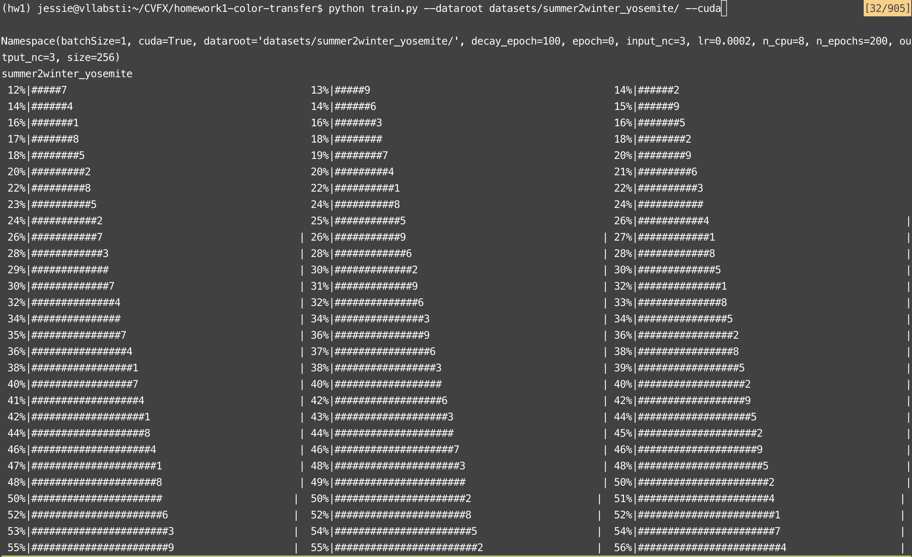
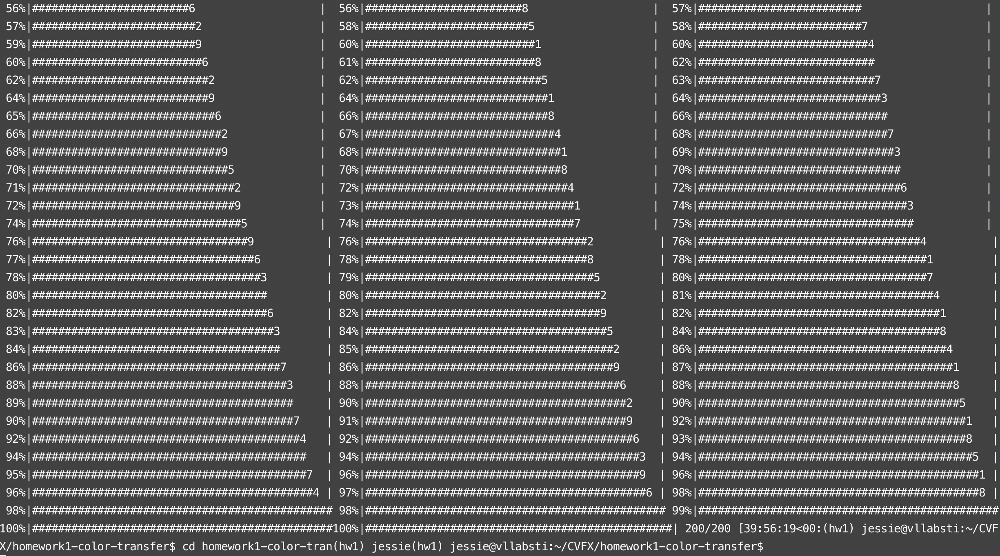
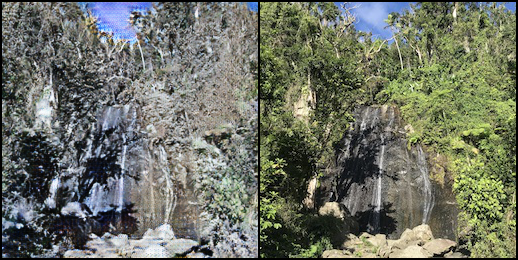
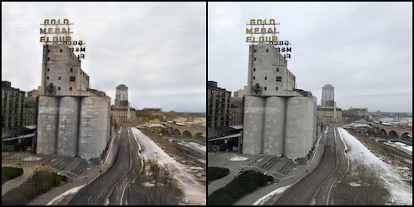

# Computer Vision for Visual Effects Homework 1 
**Team 8**  
104062329 王心瑩  
107062705 陳家昕  
104060014 許瀞予  

## 1. Training cycleGAN 
The dataset we use is summer2winter_yosemite, and it took about 40 hours to finish the training.  

## 2. Inference cycleGAN in personal image
After changing phot othe size to 256x256, I create my own dataset and run the testing command. The first image is to switch summer to winter and the second and third one is winter to summer.  
  
  
  

## 3. Compare with other method
