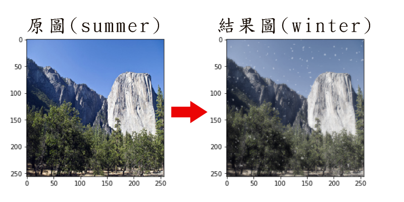
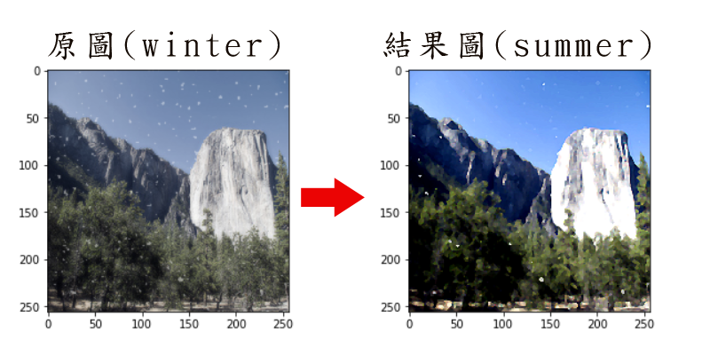
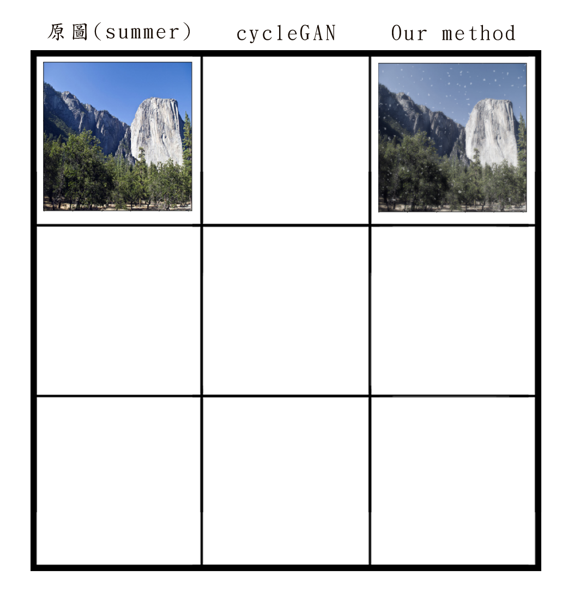

# Computer Vision for Visual Effects Homework 1 

**Team 7**  
104062329 王心瑩  
107062705 陳家昕  
104060014 許瀞予  

## 1.動機與目的
我們想研究的 color-transfer 應用是冬夏景色互換，透過 summer2winter_yosemite 這份 dataset ，可將夏天的風景照轉換成冬天，或者反過來將冬天風景照轉成夏天，而我們之所以選擇這份 dataset ，是覺得它適合應用在觀光宣傳上，讓旅客到當地除了欣賞當季景色外，也可透過這個方法快速模擬出其他季節的風光。


## 2.原本作法：cycleGAN

#### 1. Training cycleGAN 
The dataset we use is summer2winter_yosemite, and it took about 40 hours to finish the training.  


#### 2. Inference cycleGAN in personal image
After changing the photo size to 256x256, I create my own dataset and run the testing command. The first image is to switch summer to winter , second and third one is winter to summer.  
  
  
  

## 3.其他做法：
我們主要參考Photoshop這篇教學的做法:

[Photoshop Tutorial: How to Quickly Transform Summer into Winter](https://www.youtube.com/watch?v=T1qW0uAt5jw)

### summer to winter

主要是在綠色植被上加上白色積雪以及在整體畫面中飄雪




#### 詳細步驟
1. 先把原圖的G channel複製一份出來
2. 將複製後的G channel圖加上失真的Diffuse glow blur，這樣除了積雪，還會看起來有一些飄雪
3. 將上一步blur後的圖調整其透明度為50%，並和原圖blend在一起，讓原圖原本的顏色可以比較透出來
4. 接著要製作飄雪，先產生一張跟原圖size相同的Gaussian noise圖
5. 將上一步的noise圖做Gaussian blur
6. 然後把這張blur後的圖，pixel值在140以下的都改成白色(255)，其餘照舊
7. 接著再blur一次
8. 最後將上一步做好的飄雪圖blend到原圖上即完成

#### 程式碼

取得原始圖片

```
summer = Image.open('datasets/summer2winter_yosemite/testA/2010-10-05 13:45:11.jpg')
```

步驟一

```
G = np.asarray(summer)[:,:,1]
```

步驟二

```
from PIL import ImageFilter
GImg = Image.fromarray(G)
GImg = GImg.filter(ImageFilter.GaussianBlur)
```

步驟三

```
newImg = Image.blend(summer, GImg.convert(mode='RGB'), .5)
```

步驟四

```
noise = np.random.normal(110, 50, GImg.size)
```

步驟五

```
noiseImg = Image.fromarray(noise).convert('RGB')
noiseImg = noiseImg.filter(ImageFilter.GaussianBlur(radius=1)).convert('L')
```

步驟六

```
noise = np.asarray(noiseImg)
noise = np.where(noise<140, 255, noise)
```

步驟七

```
noiseImg = Image.fromarray(noise).convert('RGB').filter(ImageFilter.GaussianBlur(radius=.5)).convert('L')
```

步驟八

```
white = Image.new('RGB', newImg.size, 'white')
newImg = Image.composite(newImg, white, noiseImg)
```

### winter to summer


這塊我們目前只能做到用一些image filter來去除畫面中大部分的飄雪，如圖

```
result = toSummer.filter(ImageFilter.MedianFilter).filter(ImageFilter.SHARPEN)
```



因為白色區域有可能是天空或者是雪，難以清楚分辨，因此較難處理

## 4.兩種做法成果之分析比較

### summer to winter



分析依據:
1.圖片清晰度

2.圖片擬真程度

### winter to summer

## 5.結論

