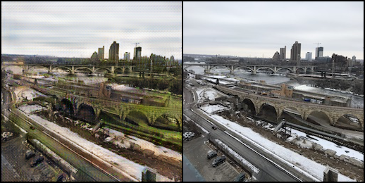
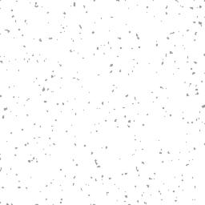

# Computer Vision for Visual Effects Homework 1 
**Team 7**  


## 動機與目的
我們想研究的 color-transfer 應用是冬夏景色互換，透過 summer2winter_yosemite 這份 dataset ，可將夏天的風景照轉換成冬天，或者反過來將冬天風景照轉成夏天，而我們之所以選擇這份 dataset ，是覺得它適合應用在觀光宣傳上，讓旅客到當地除了欣賞當季景色外，也可透過這個方法快速模擬出其他季節的風光。


## 原本作法：cycleGAN

#### 1. Training cycleGAN 
The dataset we use is summer2winter_yosemite, and it took about 40 hours to finish the training.  


#### 2. Inference cycleGAN in personal image
After changing the photo size to 256x256, I create my own dataset and run the testing command. The first 3 images are switching summer to winter, the last three are winter to summer.  
  
  
  
   
  
  

## 我們的做法：
我們主要參考Photoshop這篇教學的做法:

[Photoshop Tutorial: How to Quickly Transform Summer into Winter](https://www.youtube.com/watch?v=T1qW0uAt5jw)

### summer to winter

主要是在綠色植被上加上白色積雪以及在整體畫面中飄雪。

  

#### 詳細步驟
1. 先把原圖的G channel複製一份出來
2. 將複製後的G channel圖做Gaussian blur，這樣除了積雪，還會看起來有一些飄雪
3. 將上一步blur後的圖調整其透明度為50%，並和原圖blend在一起，讓原圖原本的顏色可以比較透出來
4. 接著要製作飄雪，先產生一張跟原圖size相同的Gaussian noise圖
5. 將上一步的noise圖做Gaussian blur
6. 然後把這張blur後的圖，pixel值在140以下的都改成白色(255)，其餘照舊
7. 接著再blur一次
8. 最後將上一步做好的飄雪圖blend到原圖上即完成

#### 程式碼

取得原始圖片

```
from PIL import Image
import matplotlib.pyplot as plt
import numpy as np
summer = Image.open('C:/Users/singi/OneDrive/桌面/2.jpg')
plt.imshow(summer)
```

  

**步驟一**：先把原圖的G channel複製一份出來

```
G = np.asarray(summer)[:,:,1]
plt.imshow(G, cmap='gray')
```


**步驟二**：將複製後的G channel圖做Gaussian blur，這樣除了積雪，還會看起來有一些飄雪

```
from PIL import ImageFilter
GImg = Image.fromarray(G)
GImg = GImg.filter(ImageFilter.GaussianBlur(radius=1))
plt.imshow(np.asarray(GImg), cmap='gray')
```


**步驟三**：將上一步blur後的圖調整其透明度為50%，並和原圖blend在一起，讓原圖原本的顏色可以比較透出來

```
newImg = Image.blend(summer, GImg.convert(mode='RGB'), .5)
plt.imshow(newImg)
```


**步驟四**：接著要製作飄雪，先產生一張跟原圖size相同的Gaussian noise圖

```
noise = np.random.normal(110, 50, GImg.size)
plt.imshow(noise, cmap='gray')
```


**步驟五**：將上一步的noise圖做Gaussian blur

```
noiseImg = Image.fromarray(noise).convert('RGB')
noiseImg = noiseImg.filter(ImageFilter.GaussianBlur(radius=1)).convert('L')
plt.imshow(noiseImg)
```


**步驟六**：然後把這張blur後的圖，pixel值在140以下的都改成白色(255)，其餘照舊

```
noise = np.asarray(noiseImg)
noise = np.where(noise<140, 255, noise)
plt.imshow(noise)
```


**步驟七**：接著再blur一次

```
noiseImg = Image.fromarray(noise).convert('RGB').filter(ImageFilter.GaussianBlur(radius=.5)).convert('L')
plt.imshow(noiseImg)
```



**步驟八**：最後將上一步做好的飄雪圖blend到原圖上即完成

```
white = Image.new('RGB', newImg.size, 'white')
newImg = Image.composite(newImg, white, noiseImg)
plt.imshow(newImg)
```


### winter to summer

在Photoshop的方法中，要反過來做winter to summer是極為困難的，因為白色區域有可能是天空、水或是雪，難以清楚分辨，也難從個別顏色channel中去找，因此這塊我們目前只能用一些image filter來做，如圖。

```
winter = Image.open('C:/Users/singi/OneDrive/桌面/4.jpg')
plt.imshow(winter.filter(ImageFilter.MedianFilter).filter(ImageFilter.SHARPEN))
```
  

## 兩種做法成果之分析比較

### summer to winter


#### 分析比較:

由上圖可看出，經過轉換後的圖片清晰度都較原圖差，而在冬天景色的擬真程度上，cycleGAN方法的整體顏色跟原圖差異較大，且只要是綠色植物都變成枯黃的顏色，較有冬天萬物蕭條的感覺；而我們的做法在整體顏色上與原圖較相似，只是將綠色植物變得不那麼鮮綠，且加上一些飄雪營造冬天的感覺。

### winter to summer


#### 分析比較:

由上圖可看出，經cycleGAN轉換後的圖片清晰度較差，而在夏天景色的擬真程度上，cycleGAN方法明顯勝過我們的做法，它會在圖中出現一些綠色的部分讓人感覺較像夏天，雖然轉成綠色的部分不一定正確(例如第三種圖的橋就變成綠色了)，但我們的做法就看不太出有夏天的感覺。

## 結論

雖然cycleGAN在training過程十分耗時耗資源，但在兩種方向轉換的整體品質上都較穩定，而我們的做法雖然較快速又不耗資源，但只有在summer to winter方向上成果較好。


